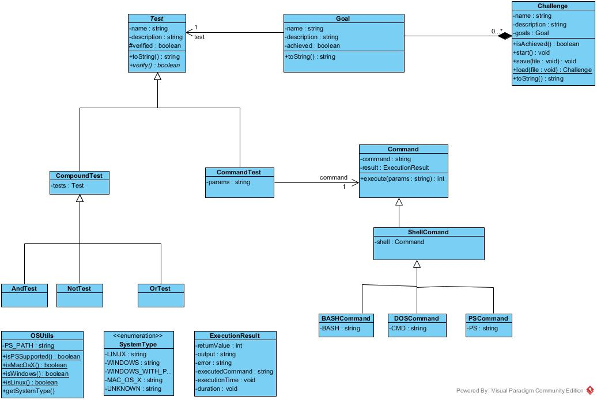

# **Challenger4SysAdmins** 

### **Analisis**

####  *<u>Descripción general de la aplicación.</u>*####

**Challenger4SysAdmin** es una aplicación de escritorio realizada con el objetivo de facilitar la gestión y  el seguimiento de las actividades propuestas por el personal docente, así como ofrecer una forma interactiva, para  afianzar la asimilación de conocimiento por parte del **alumno**, de esta manera se rompe con la metodología tradicional de realización de prácticas consiguiendo así que el alumno este motivado en aprender logrando distintos objetivos de manera interactiva con el fin de lograr una meta, y de esta manera completar la tarea propuesta por el **docente**.

Asegurando de tal forma que el alumno haya asimilado todo el conocimiento de la *práctica* propuesta  y  que a su vez el docente pueda hacer un seguimiento de la correcta realización de la misma.

<u>Diagrama de Clases</u>

------

#### *<u>Metodología practica del Alumno</u>*

En primer lugar el docente propondrá un Reto o **“Challenge"** a sus alumnos, cada reto está compuesto por uno o varios objetivos o  **“Goals”** que el alumno debe ir realizando para completar todo **Reto**, de la misma manera si el alumno considera que no es capaz de completar todo el reto podrá completarlo parcialmente y adjuntar una nota aclaratoria que el docente podrá posteriormente ver para detectar posibles **dificultades** que  le hayan podido surgir a los alumnos con respecto al **“Challenge"** propuesto, y finalmente el alumno guardara su reto y se lo enviara al profesor.

------

#### *<u>Metodología practica del Profesor</u>*

El Docente dispone de una **aplicación propia** diferente a la que tienen los alumnos, en tal aplicación será capaz de crear nuevos Retos o **“Challenges”**,pudiendo definirle un nombre al Reto así como uno o varios objetivos **“Goals”**que deberá realizar el alumno con el fin de completar el reto, además podrá definir una serie de *parámetros más específicos*.

En primer lugar el docente recibirá el **“Challenge”** que le envía el alumno y  lanzara su aplicación y cargara en la aplicación el **archivo** en concreto, a continuación vera en la aplicaciónuna serie de parámetros como pueden ser: *Nombre del Challenge*, *Nombre del Alumno*,*Porcentaje de “Goals”* completados, además de alguna nota aclaratoria en el caso de que existan **“Goals“** sin completar.

------

### *<u>Conclusión</u>*

Con esta propuesta se pretende **facilitar** el trabajo docente como el aprendizaje de los alumnos,
para así lograr los mejores resultados y que el hecho de realizar una práctica
no sea algo arcaico y aburrido.

