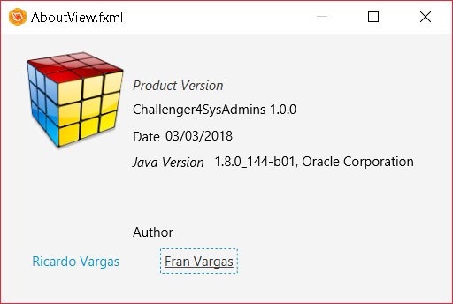
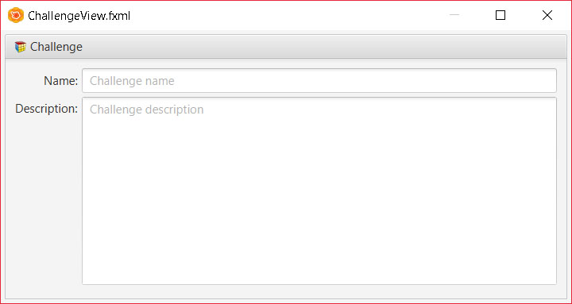
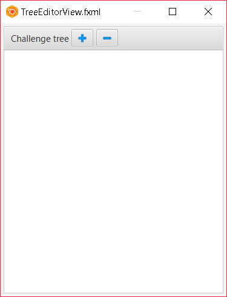
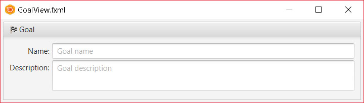
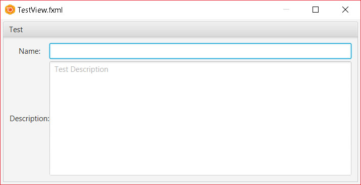
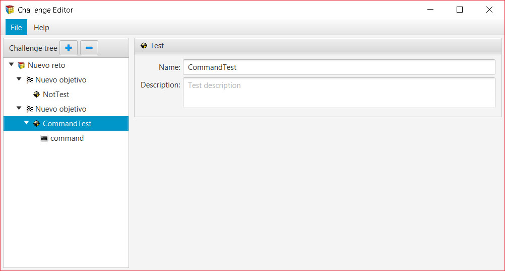

---

---

# Diseño

El diseño de la aplicación ha sido realizado mediante el framework **JavaFX**, utilizando la herramienta grafica **Scene Builder** para el desarrollo delas distintas ventanas y componentes que componen la aplicación.

La ventana del **Editor de Retos** se ha divido en varios componenteso zonas **independientes** para facilitar el tratamiento independiente de la informaciónque gestiona cada parte de la ventana, para finalmente encajar cada pieza de la ventana conformando una ventana **ensamblada** por cada pequeña parte de la misma. 

1. AboutView(Ayuda)
2. ChallengeView(Reto)
3. TreeEditorView(Arbol)
4. EmptyView(Sin Panel)
5. GoalView(Objetivos)
6. TestView(Test)
7. CompleteView(Vista Completa)

------

#### <u>Ayuda</u>

Panel de ayuda con informacion general de la aplicacion,**vercion**,fecha,autores y vercion de **java** con la que se compilo el sofware.

------

#### <u>Reto</u>

Panel que permite darle un nombre al reto a si como una descripcion de el mismo.

------

#### <u>Arbol</u>

Arbol que almacena toda la jerarquia de objetos dentro de el reto.

------

#### <u>Sin Panel</u>

Panel que se muestra cuando no hay nada selecionado en el arbol.

------

#### <u>Objetivos</u>

Panel de los objetivos que nos permite darle un nombre y una descripcion al objetivo.

------

#### <u>Test</u>

Panel de los test que nos permite darle nombre y una descripcion.

------

#### <u>Vista Completa</u>

Aspecto completo de todos los paneles ensamblados.

